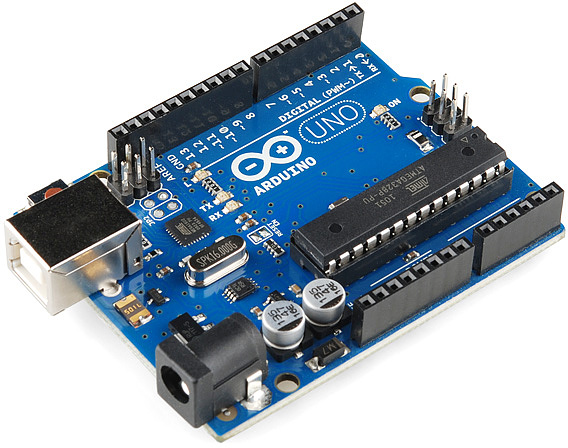
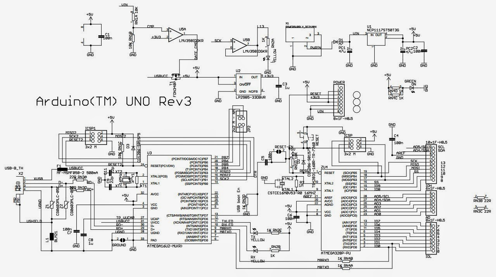

# sistem-operasi-mikroprocessor-2017
Catatan kuliah semester GENAP 2016/2017

# FreeRTOS: Task State 

A task can exist in one of the following states:

## Running

When a task is actually executing it is said to be in the Running state. It is currently utilising the processor. If the processor on which the RTOS is running only has a single core then there can only be one task in the Running state at any given time.

## Ready

Ready tasks are those that are able to execute (they are not in the Blocked or Suspended state) but are not currently executing because a different task of equal or higher priority is already in the Running state.

## Blocked

A task is said to be in the Blocked state if it is currently waiting for either a temporal or external event. For example, if a task calls vTaskDelay() it will block (be placed into the Blocked state) until the delay period has expired - a temporal event. Tasks can also block to wait for queue, semaphore, event group, notification or semaphore event. Tasks in the Blocked state normally have a 'timeout' period, after which the task will be timeout, and be unblocked, even if the event the task was waiting for has not occurred.

Tasks in the Blocked state do not use any processing time and cannot be selected to enter the Running state.

## Suspended

Like tasks that are in the Blocked state, tasks in the Suspended state cannot be selected to enter the Running state, but tasks in the Suspended state do not have a time out. Instead, tasks only enter or exit the Suspended state when explicitly commanded to do so through the vTaskSuspend() and xTaskResume() API calls respectively.

# Arduino

